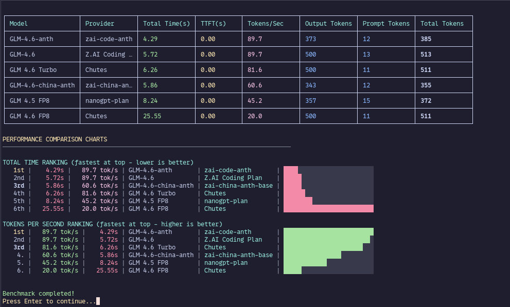

# Ai-speedometer

A CLI tool for benchmarking AI models across multiple providers with parallel execution and performance metrics.



## Install

```bash
npm install -g ai-speedometer
```

## What It Measures

- **TTFT** (Time to First Token) - How fast the first response token arrives
- **Total Time** - Complete request duration  
- **Tokens/Second** - Real-time throughput
- **Token Counts** - Input, output, and total tokens used

## New Features

- **REST API Default** - REST API benchmarking is now the default method for better compatibility
- **Headless Mode** - Run benchmarks without interactive CLI using command-line arguments
- **Streaming Support** - Full streaming support now available in REST API benchmarks

## Quick Setup

1. **Set Model**
   ```bash
   ai-speedometer
   # Select "Set Model" → "Add Verified Provider" → Choose provider (OpenAI, Anthropic, etc.)
   # Enter your API key when prompted
   ```

2. **Choose Model Provider**
    - Verified providers (OpenAI, Anthropic, Google) - auto-configured
    - Custom verified providers (pre-configured trusted providers) - add API key
    - Custom providers (Ollama, local models) - add your base URL

3. **Add API Key**
   - Get API keys from your provider's dashboard
   - Enter when prompted - stored securely in:
     - `~/.local/share/opencode/auth.json` (primary storage)
     - `~/.config/ai-speedometer/ai-benchmark-config.json` (backup storage)
     - Both files store verified and custom verified provider keys

4. **Run Benchmark**
   ```bash
   ai-speedometer
   # Select "Run Benchmark (REST API)" → Choose models → Press ENTER
   # Note: REST API is now the default benchmark method
   ```

## Usage

```bash
# Start CLI
ai-speedometer

# Or use short alias  
aispeed

# Debug mode
ai-speedometer --debug

# Headless mode - run benchmark directly
ai-speedometer --bench openai:gpt-4
# With custom API key
ai-speedometer --bench openai:gpt-4 --api-key "sk-your-key"
# Use AI SDK instead of REST API
ai-speedometer --bench openai:gpt-4 --ai-sdk
```

## Configuration Files

API keys and configuration are stored in:

- **Verified + Custom Verified Providers**: 
  - Primary: `~/.local/share/opencode/auth.json`
  - Backup: `~/.config/ai-speedometer/ai-benchmark-config.json` (verifiedProviders section)
- **Custom Providers**: `~/.config/ai-speedometer/ai-benchmark-config.json` (customProviders section)
- **Provider Definitions**: `./custom-verified-providers.json`

## Requirements

- Node.js 18+
- API keys for AI providers
- Terminal with arrow keys and ANSI colors
