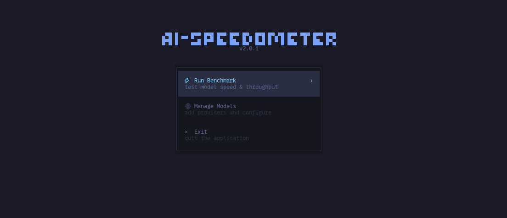
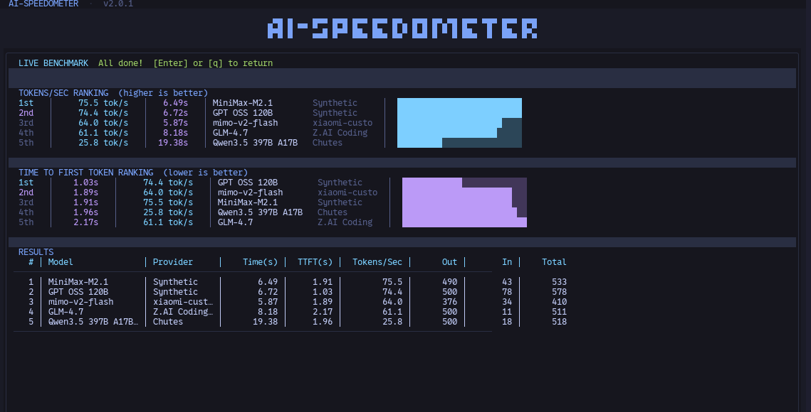

# Ai-speedometer

A CLI tool for benchmarking AI models across multiple providers with parallel execution and performance metrics.

[](https://discord.gg/6S7HwCxbMy)

Track OSS model speeds over time: [ai-speedometer.oliveowl.xyz](https://ai-speedometer.oliveowl.xyz/)





## Packages

The project is a monorepo split into three packages:

| Package | Description | Runtime |
|---|---|---|
| `ai-speedometer` | Full TUI + headless benchmark CLI | Bun 1.0+ |
| `ai-speedometer-headless` | Headless benchmark only, no TUI deps | Node.js 18+ or Bun |
| `@ai-speedometer/core` | Shared benchmark engine (private) | — |

## Install

### Standard (TUI + Headless)
Full interactive terminal UI and headless benchmark support. Requires [Bun](https://bun.sh).

```bash
bun install -g ai-speedometer
```

### Headless Only (Lightweight)
No TUI dependencies — runs on **Node.js or Bun**. Ideal for CI/CD, Docker, and scripts.

```bash
npm install -g ai-speedometer-headless
# or
bun install -g ai-speedometer-headless
```

Or run directly from source:

```bash
bun run packages/ai-speedometer/src/index.ts
```

## What It Measures

- **TTFT** (Time to First Token) - How fast the first response token arrives
- **Total Time** - Complete request duration
- **Tokens/Second** - Real-time throughput
- **Token Counts** - Input, output, and total tokens used

## Usage

### Interactive TUI (`ai-speedometer` only)
```bash
ai-speedometer
# or short alias
aispeed
```

### Headless Benchmark (both packages)

```bash
# Verified provider
ai-speedometer --bench openai:gpt-4o
ai-speedometer-headless --bench openai:gpt-4o

# With explicit API key
ai-speedometer-headless --bench openai:gpt-4o --api-key "sk-..."

# Custom provider
ai-speedometer-headless --bench-custom myprovider:mymodel \
  --base-url https://api.example.com \
  --api-key "..."

# Pretty-print JSON output
ai-speedometer-headless --bench openai:gpt-4o --formatted

# Custom endpoint format
ai-speedometer-headless --bench-custom myprovider:mymodel \
  --base-url https://... --endpoint-format chat/completions
```

## Features
- **Monorepo Architecture** - Split into `core`, `ai-speedometer` (TUI), and `ai-speedometer-headless` (dedicated CLI)
- **Interactive TUI** - Full terminal UI with theming support, menus, search, and live benchmark progress
- **Headless Mode** - Run benchmarks without interactive UI via CLI flags — outputs JSON, perfect for CI/CD
- **Node.js Compatible Headless** - `ai-speedometer-headless` targets Node.js, no Bun required
- **REST API Benchmarking** - Works with all OpenAI-compatible providers
- **Parallel Execution** - Benchmark multiple models simultaneously
- **Provider Management** - Add verified, custom verified, and custom providers

## Development

```bash
# Run from source (monorepo)
bun run packages/ai-speedometer/src/index.ts

# Build all packages
bun run build

# Specific builds
bun run build:tui        # -> packages/ai-speedometer/dist/
bun run build:headless   # -> packages/ai-speedometer-headless/dist/

# Run tests
bun test

# Typecheck
bun run typecheck
```

## Configuration Files

API keys and configuration are stored in:

- **Verified + Custom Verified Providers**:
  - Primary: `~/.local/share/opencode/auth.json`
  - Backup: `~/.config/ai-speedometer/ai-benchmark-config.json` (verifiedProviders section)
- **Custom Providers**: `~/.config/ai-speedometer/ai-benchmark-config.json` (customProviders section)
- **Provider Definitions**: `./custom-verified-providers.json` (bundled at build time)
- **Theme**: set `"theme"` in `ai-benchmark-config.json` — available themes:
  - Dark: `tokyonight` (default), `dracula`, `catppuccin`, `kanagawa`, `rosepine`, `nord`
  - Light: `github`, `everforest`, `solarized`

## Requirements

- **`ai-speedometer`**: Bun 1.0+ (install from [bun.sh](https://bun.sh))
- **`ai-speedometer-headless`**: Node.js 18+ or Bun 1.0+
- API keys for AI providers
- Terminal with ANSI color support (TUI only)
