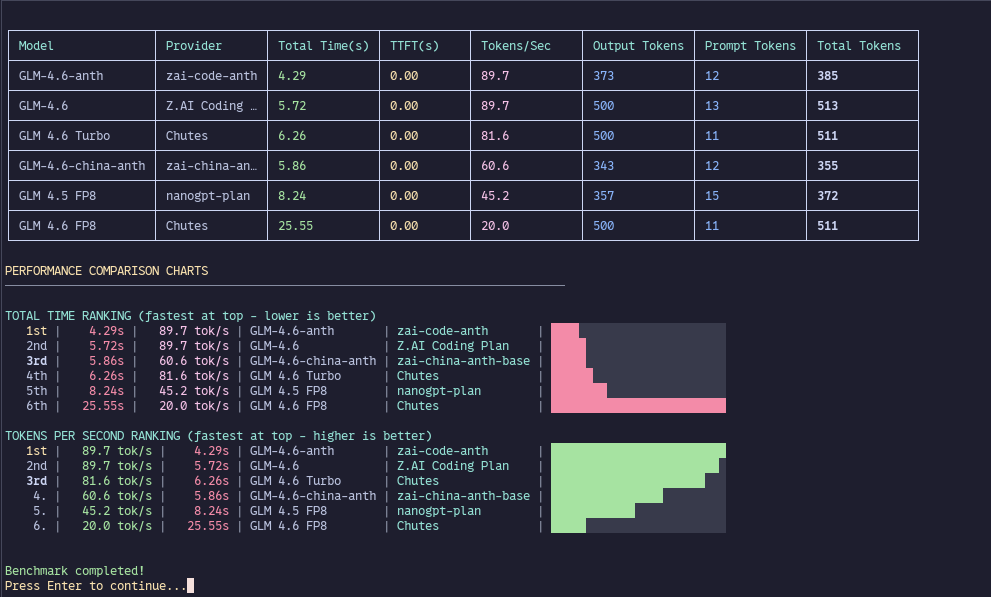

# Ai-speedometer

A CLI tool for benchmarking AI models across multiple providers with parallel execution and performance metrics.



## Install

```bash
npm install -g ai-speedometer
```

Or run directly from source with Bun:

```bash
bun src/index.ts
```

## What It Measures

- **TTFT** (Time to First Token) - How fast the first response token arrives
- **Total Time** - Complete request duration
- **Tokens/Second** - Real-time throughput
- **Token Counts** - Input, output, and total tokens used

## Features

- **Interactive TUI** - Full terminal UI with Tokyo Night theme, menus, search, and live benchmark progress
- **REST API Benchmarking** - Default method, works with all OpenAI-compatible providers
- **Headless Mode** - Run benchmarks without interactive CLI using command-line arguments
- **Parallel Execution** - Benchmark multiple models simultaneously
- **Provider Management** - Add verified, custom verified, and custom providers

## Quick Setup

1. **Set Model**
   ```bash
   ai-speedometer
   # Select "Run Benchmark" → "Add Verified Provider" → Choose provider (OpenAI, Anthropic, etc.)
   # Enter your API key when prompted
   ```

2. **Choose Model Provider**
    - Verified providers (OpenAI, Anthropic, Google) - auto-configured via models.dev
    - Custom verified providers (pre-configured trusted providers) - add API key
    - Custom providers (Ollama, local models) - add your base URL

3. **Add API Key**
   - Get API keys from your provider's dashboard
   - Enter when prompted - stored securely in:
     - `~/.local/share/opencode/auth.json` (primary storage)
     - `~/.config/ai-speedometer/ai-benchmark-config.json` (backup storage)

4. **Run Benchmark**
   ```bash
   ai-speedometer
   # Select "Run Benchmark" → choose models → press Enter
   ```

## Usage

```bash
# Start interactive TUI
ai-speedometer

# Short alias
aispeed

# Debug mode
ai-speedometer --debug

# Headless benchmark
ai-speedometer --bench openai:gpt-4
# With custom API key
ai-speedometer --bench openai:gpt-4 --api-key "sk-your-key"
# Custom provider
ai-speedometer --bench-custom myprovider:mymodel --base-url https://... --api-key "..."
```

## Development

```bash
# Run from source
bun src/index.ts

# Run with auto-reload
bun --watch src/index.ts

# Run tests
bun test

# Typecheck
bun run typecheck

# Build standalone binary
bun run build   # → dist/ai-speedometer
```

## Configuration Files

API keys and configuration are stored in:

- **Verified + Custom Verified Providers**:
  - Primary: `~/.local/share/opencode/auth.json`
  - Backup: `~/.config/ai-speedometer/ai-benchmark-config.json` (verifiedProviders section)
- **Custom Providers**: `~/.config/ai-speedometer/ai-benchmark-config.json` (customProviders section)
- **Provider Definitions**: `./custom-verified-providers.json` (bundled at build time)

## Requirements

- **Runtime**: Bun 1.0+ (required — install from [bun.sh](https://bun.sh))
- API keys for AI providers
- Terminal with arrow keys and ANSI colors
